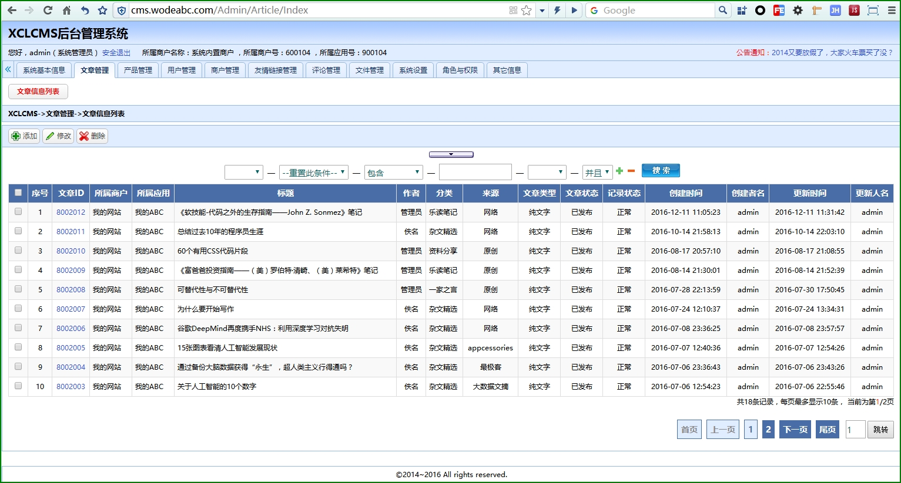
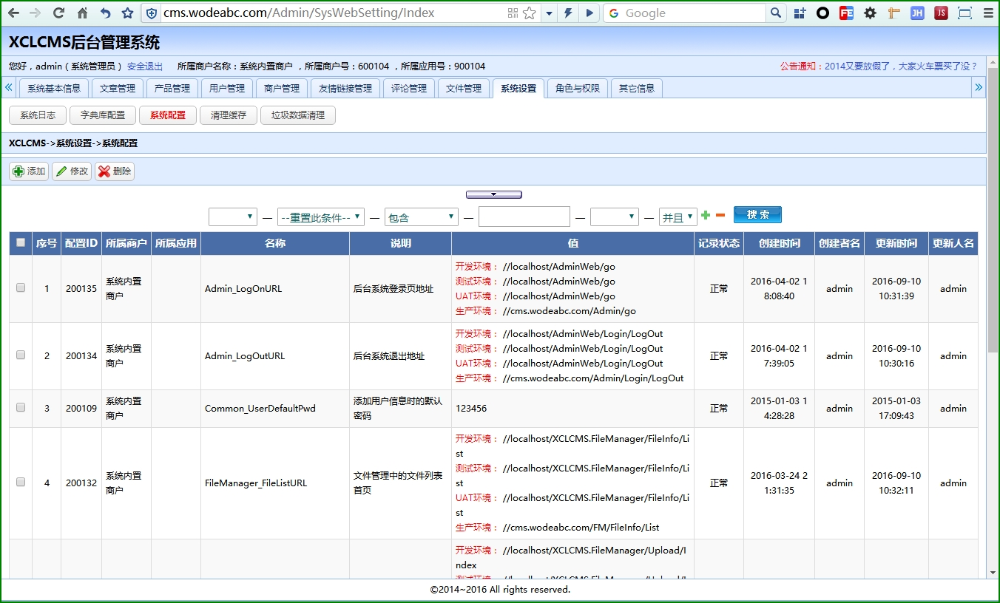
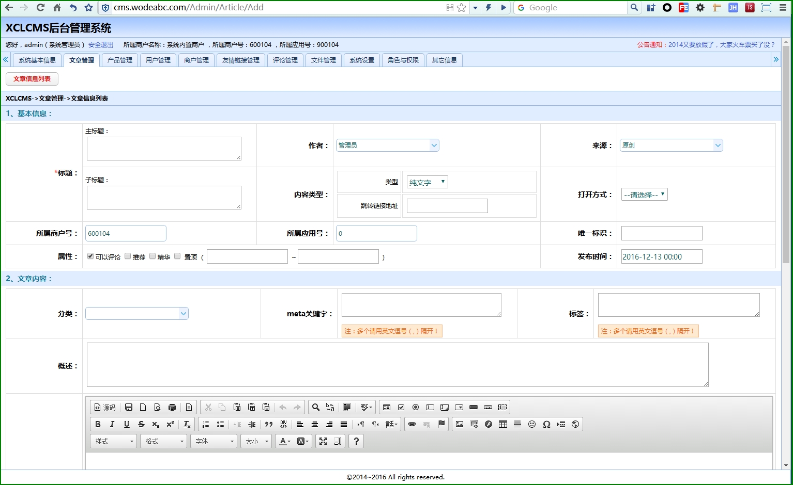
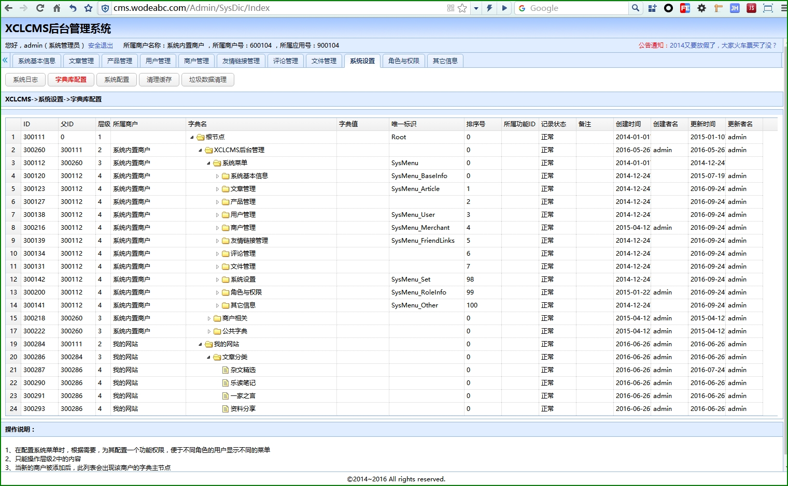
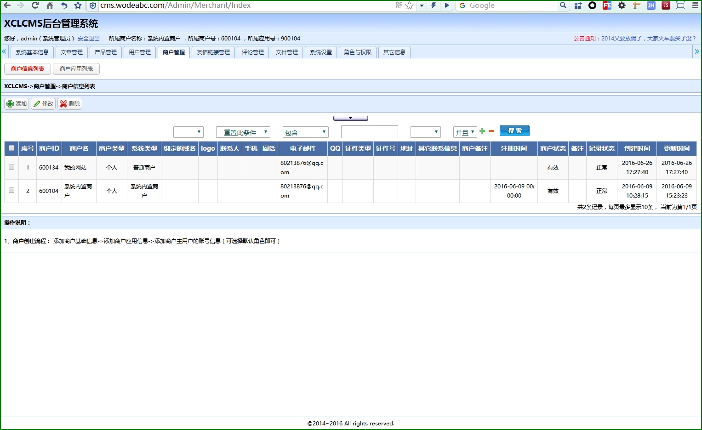
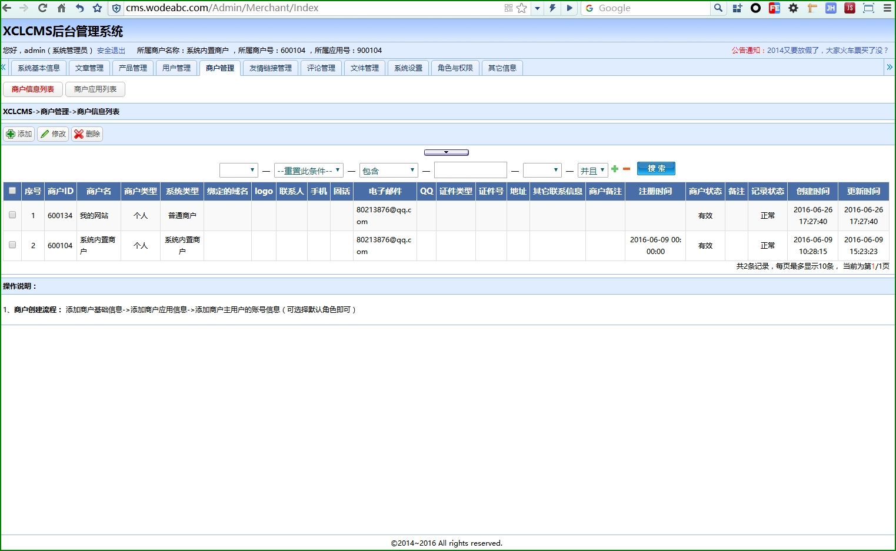
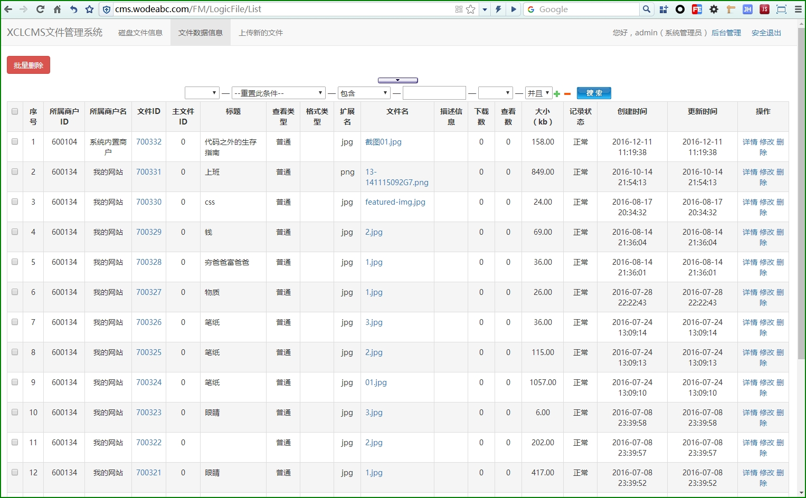

[English](README.md)  [中文](README_CN.md)

## **Introduction**

XCLCMS is a **lightweight** CMS (content management system) **background management system**, Developed using asp.net MVC, it provides a simple and easy-to-use web API interface and supports multiple applications for a single merchant.

## Features
- One background, multiple front-end application interfaces (each business can have multiple applications according to the application number, such as using this system to manage the content of multiple blogs or enterprise sites at the same time)
- Provide a lightweight Web Api to quickly access new applications
- There is not much technical requirement for new functionality extension
- Simple and practical, suitable for individuals and small and medium enterprises (it is best to suit yourself)
- This system is a background management system, and each foreground application needs to be implemented according to the Web Api

## Applicable Scenarios
- There is a mobile App, but no background management. I want to update App data through a management system
- Want to quickly build a front desk data display page of a blog or enterprise site
- Want to build multiple blogs, enterprise sites and apps, but only want to use one background to maintain all data
- Just want to use the backend system purely and then extend some business modules

## Software Architecture
1. Build with C# & ASP.NET MVC 5 (.net Framework 4.6)
2. The database uses MSSQL2012
3. The interface framework uses jQuery easyUI
4. The front desk script: jQuery and Javascript, TypeScript, AngularJs

## Project Structure
1. XCLCMS.Data.BLL: Data business layer
2. XCLCMS.Data.CommonHelper: Data layer public processing
3. XCLCMS.Data.DAL: Database access layer
4. XCLCMS.Data.Model: Data entity layer
5. XCLCMS.Data.WebAPIEntity: Web Api Data entity layer
6. XCLCMS.Document: Project Document related
7. XCLCMS.FileManager: File management and upload web sites (**file management background site portal**)
8. XCLCMS.Lib: Foreground public processing library
9. XCLCMS.View.AdminWeb: Background management system web site (**manages background site entry**)
10. XCLCMS.IService.WebAPI: Web Api service definition layer
11. XCLCMS.IService.Logger: Logging service definition layer
12. XCLCMS.Service.WebAPI: Web Api Service logic implementation layer
13. XCLCMS.Service.Logger: Logging Service implementation layer
14. XCLCMS.WebAPI: Web Api HTTP service provider layer (**Web Api site portal**)

## Basic Functions
- Article management
- Order management
- Product management
- User management
- Merchant management
- Manage friendship links
- Comment management
- File management
- Role permission management
- Advertising space management
- Label management
- ...

## Data Flow

## Documents

- [Deployment documentation](https://github.com/xucongli1989/XCLCMS/blob/master/%E5%A6%82%E4%BD%95%E9%83%A8%E7%BD%B2.md)
- [Static resource documentation](https://github.com/xucongli1989/XCLCMS/blob/master/%E9%9D%99%E6%80%81%E8%B5%84%E6%BA%90%E8%AF%B4%E6%98%8E.md)

## Web API Documents

[http://cms.wodeabc.com/api/help](http://cms.wodeabc.com/api/help) or [http://cms.wodeabc.com/api/swagger/](http://cms.wodeabc.com/api/swagger/)

## Demo
- Front blog site:[My ABC](http://www.wodeabc.com)
- Admin（[http://cms.wodeabc.com/admin](http://cms.wodeabc.com/admin)），UserName:test，Password:123456

## Progress
- Started coding in October 2014

- V2.0 version completed: 90%

- [The plan](https://github.com/xucongli1989/XCLCMS/projects/1)

  > 1.The official version number is V2.0 because the copyright of v1.0 has been applied
  >
  > 2.The official version has not been developed yet, some of the existing modules may have a big change, if you don't mind, it can be developed directly under the legal license agreement. 

## Milestone
- Dec. 16, 2016 -- Applied for copyright (soft copy no. 1554794)
- 2015-03-21 -- Open source on GitHub
- 2014-10-01 -- Project approval, and start coding

## Feedback
If you find any serious bugs in software use, or if you have good comments or suggestions, please email us. Thank you!E-mail:80213876@qq.com

## Apache License 2.0
[LICENSE](LICENSE)

## To Donate
**(Personal: 499 yuan;Enterprises: 4,999 yuan)** friends, in legitimate commercial activities, based on the original license to freely use this software.
> Notice: Donation is voluntary, it is your recognition and encouragement to software workers, and it does not represent relevant employment behaviors such as technical support and requirement customization.
>
All questions concerning this project may be addressed by email or issue.

**Donation method:**

**Thank you to the donor:**

> 2017-06-01：*乐 &yen;200（Alipay serial number：9336943）

> 2016-11-25：*yhq &yen;10（Alipay serial number：88272280）

> 2016-10-19：*民顺  &yen;1（WeChat serial number：94308336）

## Preview

